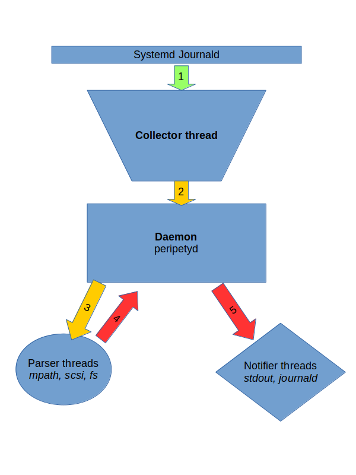

<!-- vim-markdown-toc GFM -->

* [Storage Event Notification Daemon](#storage-event-notification-daemon)
    * [Features](#features)
    * [How-to](#how-to)
    * [Event example](#event-example)
    * [Thread types](#thread-types)
    * [Workflow](#workflow)
    * [Daemon Configuration.](#daemon-configuration)
    * [FAQ](#faq)
        * [What can be done by kernel](#what-can-be-done-by-kernel)
        * [Why another daemon?](#why-another-daemon)
            * [Why not expand udisks for this?](#why-not-expand-udisks-for-this)
            * [Why this tool is better?](#why-this-tool-is-better)

<!-- vim-markdown-toc -->

# Storage Event Notification Daemon

## Features

 * Provides device consistent id, event type and extra information like
   FC/iSCSI path detail and FS mount point.

 * CLI tool `prpt` to query and monitor events.

 * Use sysfs and devfs for information query only. Designed to handle
   log burst.

 * Events are stored in journald with structured data(JSON).

 * Allows user defined regex in /etc/peripetyd.conf.

 * TBD: C/python/rust lightweight library for query block information
   on all kind of dev string(major:minor, scsi_id, nvme ctrl_id+ns_id,
   etc).

 * TODO: Varlink(json) interface.

 * TODO: Handle user space tool logs like mulitpathd, iscsid.


## How-to

 * Start Daemon

```bash
make
make run
```

 * Start monitor CLI

```bash
./target/debug/prpt monitor --format JsonPretty
```

 * Trigger some events

```
# SCSI sector hardware error
./tests/scsi.sh
# Multipath path failure
./tests/dmmp.sh
# File system I/O error
./tests/fs.sh
# File system over LVM over multipath
./tests/fs_lvm_dmmp.sh
# LVM ThinProvisioning pool full
./tests/lvm_tp.sh
```

 * Query events

```bash
./target/debug/prpt query
```

## Event example

* [Ext4 mounted on LVM LV over SCSI multipath][2]

* [FC Multipath got path failure][3]

## Thread types
* **Collector**

  Collects raw events from journald.
  For a raw event, `dev_wwid` might be missing and `dev_name` might not
  be human friendly (for example, a SCSI disk event might have `dev_name`
  "4:0:0:1").
  TODO: Allows use to extend regex used for parsing journals.

* **Parser**

  Parses both raw and synthetic events then generates synthetic events for
  collectors.
  For the generated synthetic events the parser must provide a valid and
  consistent `dev_wwid` and human-friendly `dev_name` value.
  Restricts the events it parses to an appropriate subset using a filter.

  Examples: `mpath`, `scsi`, `fs`, and `dm` thread.

* **Notifier**

  Listens to all events, and generates appropriate actions.

  Examples: `stdout`, `journald`, `email`, `irc`, etc.

## Workflow



0. The daemon starts all threads.
1. The `collector` thread collects an event from journald.
2. The `collector` thread parse the event and sends the raw event to the daemon.
3. The daemon sends the event to selected parser threads based on their filter
   settings.
4. The selected parser plugins process the event and each sends a synthetic
   event back to the daemon.
5. The daemon broadcasts all synthetic events to notifier threads.

## Daemon Configuration.

The configuration file will be `/etc/peripetyd.conf`, example:

```toml
[main]
notify_stdout = true
save_to_journald = true

[[collector_regexs]]
# This regex is already build-in.
starts_with = "device-mapper: multipath:"
regex = '''(?x)
        ^device-mapper:\s
        multipath:\ Failing\ path\s
        (?P<kdev>\d+:\d+).$
'''
# `kdev` naming capture group is mandatory.
# `sub_system` naming capture group is optional.
sub_system = "multipath"
event_type = "DM_MPATH_PATH_FAILED"
```

## FAQ

### What can be done by kernel
I have created [some patches][1] hoping kernel could provides in logs:
 * Structured log via /dev/kmsg.
 * WWID of device matters to fix race issue.
 * Event type string to save regex capture.

### Why another daemon?

#### Why not expand udisks for this?

 * Current design of udisks require modules written in C which is not a good
   language for string manipulation which is quit common when parsing eventing.

 * Udisks components are trigger by uevent which only have add/change/del
   event type defined, modules need to extra work to find out what just
   happened. Yes, we can change udisks to support event types, but IMHO, that
   require much more work than creating new storage event daemon in rust.

#### Why this tool is better?

 * Rust is memory-leak-proof and quite easy to handle threading, IPC and string
   manipulation.

 * Only do one thing quick and simple -- provide storage events.

[1]: https://github.com/cathay4t/linux/commits/structured_log
[2]: https://github.com/cathay4t/peripety/blob/master/examples/fs/ext4_mount_lv_mpath_scsi.json
[3]: https://github.com/cathay4t/peripety/blob/master/examples/mpath/mpath_fc_path_offline.json
